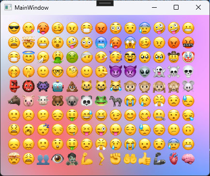

# EmojiTextBlock

A custom WPF control for rendering text with emoji support. EmojiTextBlock extends the standard `TextBlock` to enhance its rendering capabilities, making it ideal for modern applications that require emoji integration.

- Emoji rendering in this project uses the **Apple Font** created by [FrayxRulez](https://github.com/FrayxRulez).
  
⭐️ If you like this project, feel free to star the repository and contribute!
